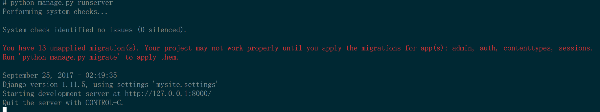
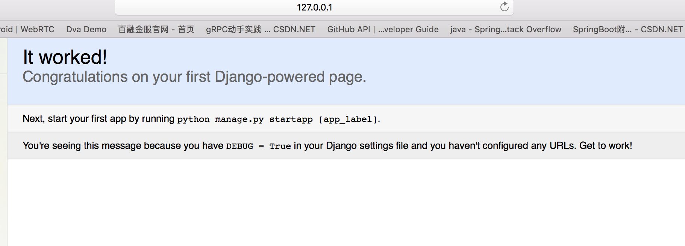

第一章 创建第一个项目
=====================

任何情况下，首先确认软硬件网络环境。

1.	操作系统
2.	`Python` 版本
3.	`Django` 的版本
4.	网络是否连通

快速验证一下安装版本

```
python -m django --version
```

设想第一个项目
--------------

1.	满足基本的几项功能，甚至仅有一项功能 `Hello world`
2.	运行在特定的软硬件环境，如果可能的话需要网络服务
3.	需要脚手架来产生项目框架
4.	有一系列的初始化配置让我很挠头
5.	怎么链接数据库呢？
6.	有哪些与Django有关的特殊配置项，或与应用有关的特殊配置项？

从脚手架开始
------------

```
$ django-admin startproject mysite
```

看看项目的目录结构

```
mysite/
    manage.py
    mysite/
        __init__.py
        settings.py
        urls.py
        wsgi.py

```

解释一下目录结构
----------------

-	根目录 `mysite/`
-	`manage.py`: 命令行交互工具
-	`The inner mysite/ directory` 真正的项目文件夹
-	`mysite/**init**.py`:
-	`mysite/settings.py`: 配置文件
-	`mysite/urls.py`: 路由控制表 **正则表达式**
-	`mysite/wsgi.py`:

运行
----

```
python manage.py runserver
```

Docker环境的特殊要求

如果需要在主机访问容器的话需要映射，这里 `48000:8000`

```
python manage.py runserver 0:8000
```

首次运行，查看控制台输出

```
# python manage.py runserver
Performing system checks...

System check identified no issues (0 silenced).

You have 13 unapplied migration(s). Your project may not work properly until you apply the migrations for app(s): admin, auth, contenttypes, sessions.
Run 'python manage.py migrate' to apply them.

September 25, 2017 - 02:49:35
Django version 1.11.5, using settings 'mysite.settings'
Starting development server at http://127.0.0.1:8000/
Quit the server with CONTROL-C.
```

控制台输出，提醒进行 **13** 个迁移。

从应用层面上看

-	admin 后台管理
-	auth 权限认证或授权
-	contenttypes 类型管理
-	sessions 会话管理



迁移
----

```
python manage.py migrate
```

迁移过程中的控制台输出

```
# python manage.py migrate
Operations to perform:
  Apply all migrations: admin, auth, contenttypes, sessions
Running migrations:
  Applying contenttypes.0001_initial... OK
  Applying auth.0001_initial... OK
  Applying admin.0001_initial... OK
  Applying admin.0002_logentry_remove_auto_add... OK
  Applying contenttypes.0002_remove_content_type_name... OK
  Applying auth.0002_alter_permission_name_max_length... OK
  Applying auth.0003_alter_user_email_max_length... OK
  Applying auth.0004_alter_user_username_opts... OK
  Applying auth.0005_alter_user_last_login_null... OK
  Applying auth.0006_require_contenttypes_0002... OK
  Applying auth.0007_alter_validators_add_error_messages... OK
  Applying auth.0008_alter_user_username_max_length... OK
  Applying sessions.0001_initial... OK
```

```
python manage.py runserver 0:8000
```


