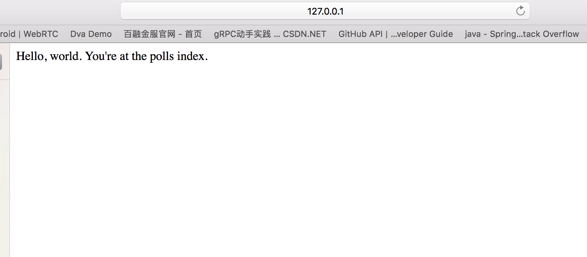

创建第一个应用
==============

神秘的脚手架
------------

```
python manage.py startapp polls
```

目录结构
--------

```
polls/ **init**.py
admin.py
apps.py
migrations/ **init**.py
models.py
tests.py
views.py
```

创建第一个视图
--------------

`polls/views.py`

```
from django.http import HttpResponse

def index(request):
  return HttpResponse("Hello, world. You're at the polls index.")

```

`polls/urls.py`

```
from django.conf.urls import url
from . import views

urlpatterns = \[ url(r'^$', views.index, name='index'), ]
```

新增的路由需要引入到总路由表中

`mysite/urls.py`,

```
from django.conf.urls import include, url
from django.contrib import admin

urlpatterns = \[ url(r'^polls/',  include('polls.urls')),
  url(r'^admin/', admin.site.urls), ]

```

在浏览器中打开如下地址( *端口号或地址可能不能* )

**http://127.0.0.1:48000/polls/**


