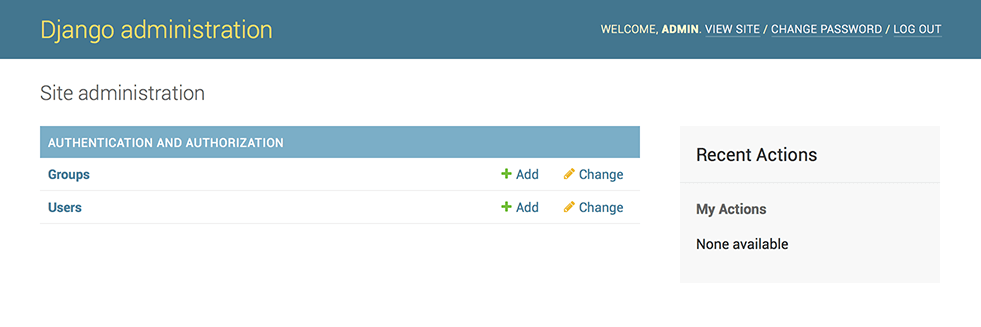
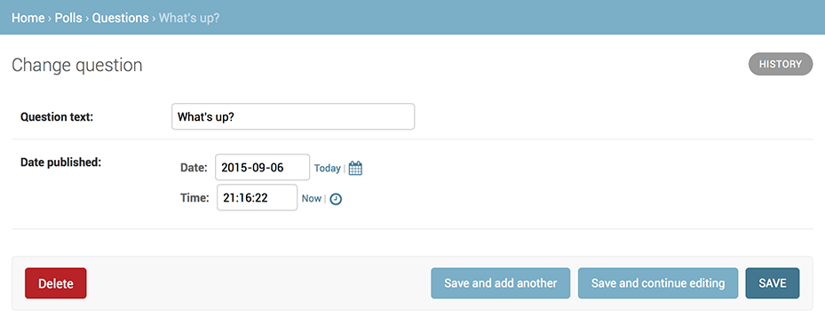

创建管理后台
============

```
python manage.py createsuperuser
```

-	Username: `admin`
-	Password: `1q2w3e4r5t`

访问管理后台
============

```
$ python manage.py runserver 0:8000
```

打开浏览器访问

`http://127.0.0.1:8000/admin/`


进入管理后台
------------







